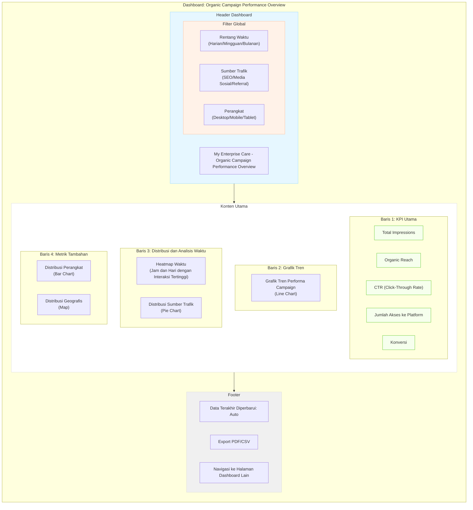
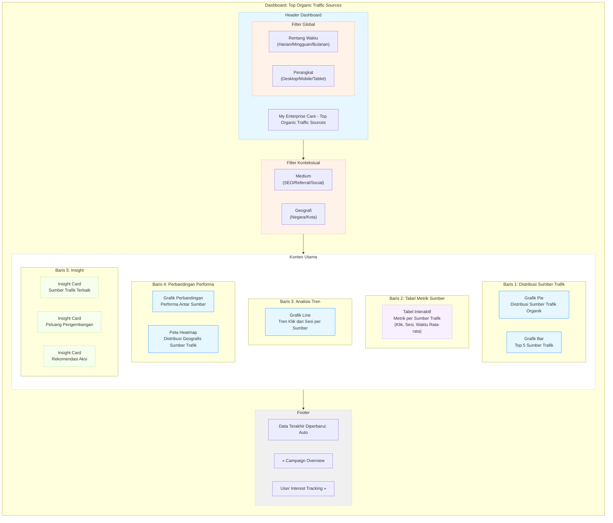
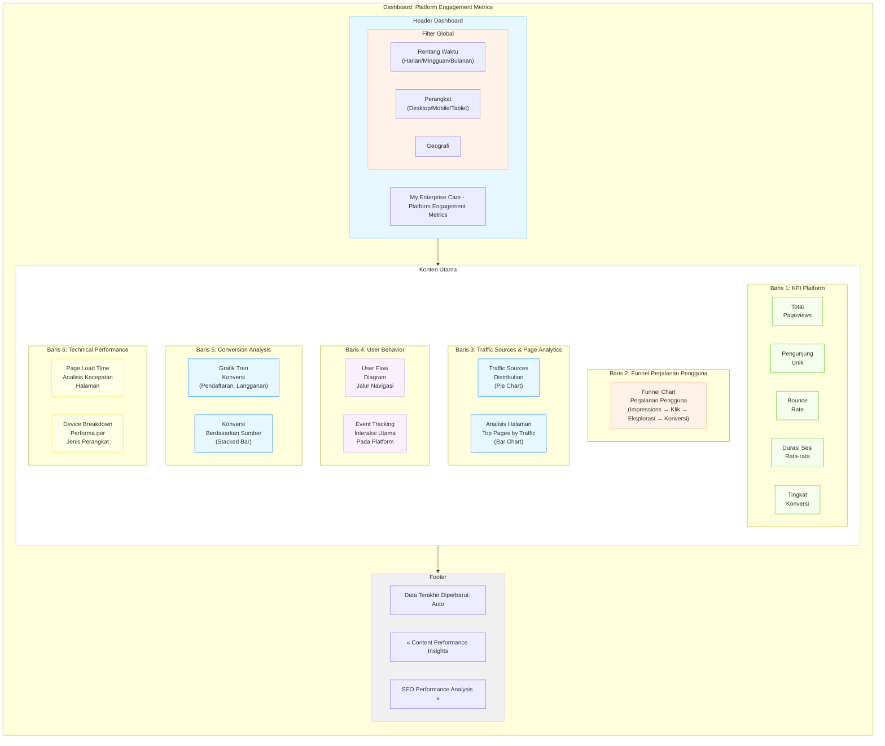

# Dokumentasi Dashboard Campaign Organik - My Enterprise Care

## Table of Contents
1. [Tujuan Dashboard](#tujuan-dashboard)  
2. [Integrasi Data](#integrasi-data)  
   - [Sumber Data](#sumber-data)  
3. [Struktur Dashboard](#struktur-dashboard)  
   - [Dashboard Utama: Campaign Overview](#1-dashboard-utama-campaign-overview)  
   - [Sumber Trafik: Organic Traffic Sources](#2-sumber-trafik-organic-traffic-sources)  
   - [Ketertarikan Pengguna: User Interest Tracking](#3-ketertarikan-pengguna-user-interest-tracking)  
   - [Performa Konten Campaign](#4-performa-konten-campaign)  
   - [Trafik ke Platform Web](#5-trafik-ke-platform-web)  
   - [Performa SEO](#6-performa-seo)  
   - [Insight dan Rekomendasi Strategis](#7-insight-dan-rekomendasi-strategis)  
   - [Kesimpulan dan Rencana Tindak Lanjut](#8-kesimpulan-dan-rencana-tindak-lanjut)  
4. [Best Practices untuk Dashboard di Google Looker Studio](#best-practices-untuk-dashboard-di-google-looker-studio)  
5. [Rekomendasi Filter Dashboard](#rekomendasi-filter-dashboard)  
   - [Filter Global](#filter-global)  
   - [Filter Kontekstual](#filter-kontekstual)  
6. [Kesimpulan](#kesimpulan)  

---

## Tujuan Dashboard
Dashboard ini bertujuan untuk:
1. **Melacak performa campaign organik** dalam menarik pengguna ke platform web **My Enterprise Care**.
2. **Mengukur tingkat ketertarikan pengguna** berdasarkan interaksi, engagement, dan perilaku.
3. **Menilai efektivitas campaign** dalam mendorong trafik organik, engagement, dan konversi di platform.

---

## Integrasi Data

### Sumber Data
- **Google Analytics 4 (GA4):**
  - Trafik organik, sumber/medium, perilaku pengguna, konversi, dan metrik lainnya.  
- **Google Search Console:**  
  - Data performa SEO seperti klik, impressions, CTR, dan ranking kata kunci.  
- **Platform My Enterprise Care:**  
  - Data internal untuk interaksi pengguna setelah mereka mengakses platform.

---

## Struktur Dashboard

### 1. Dashboard Utama: Campaign Overview
**Judul:** "Organic Campaign Performance Overview"  
- **Visualisasi:**
  - **KPI Utama:**  
    - Total impressions, organic reach, CTR, jumlah akses ke platform, dan konversi.  
  - **Grafik Tren:**  
    - Performa campaign dari waktu ke waktu (line chart).  
  - **Heatmap Waktu:**  
    - Jam dan hari dengan interaksi tertinggi.  
- **Filter Global:**  
  - Waktu (harian, mingguan, bulanan).  
  - Sumber trafik (SEO, media sosial, referral).  
  - Perangkat (desktop, mobile, tablet).  
- **Fokus:**  
  Memberikan ringkasan performa campaign secara keseluruhan.


---

### 2. Sumber Trafik: Organic Traffic Sources
**Judul:** "Top Organic Traffic Sources"  
- **Visualisasi:**
  - Grafik pie untuk distribusi sumber trafik organik (e.g., SEO, media sosial, referral).  
  - Tabel interaktif untuk melihat metrik tiap sumber (e.g., klik, sesi, waktu rata-rata di platform).  
- **Filter Kontekstual:**  
  - Medium (SEO, referral, social).  
  - Geografi (negara, kota).  
- **Fokus:**  
  Mengidentifikasi sumber trafik utama yang berkontribusi terhadap akses ke platform.


---

### 3. Ketertarikan Pengguna: User Interest Tracking
**Judul:** "User Engagement Metrics"  
- **Visualisasi:**
  - Grafik bar untuk engagement di media sosial (e.g., likes, shares, comments).  
  - Grafik scatter untuk konten yang paling banyak diakses.  
  - Tabel kata kunci organik yang mengarahkan pengguna ke platform (dari Google Search Console).  
- **Filter Kontekstual:**  
  - Jenis konten (blog, video, infografis).  
  - Kata kunci (terpopuler, dengan CTR tinggi).  
- **Fokus:**  
  Mengidentifikasi topik atau jenis konten yang menarik bagi pengguna.

  ```mermaid
  flowchart TD
    subgraph Dashboard["Dashboard: User Engagement Metrics"]
        direction TB
        
        subgraph Header["Header Dashboard"]
            direction LR
            title["My Enterprise Care - User Engagement Metrics"]
            subgraph FilterGlobal["Filter Global"]
                direction LR
                dateRange["Rentang Waktu\n(Harian/Mingguan/Bulanan)"]
                device["Perangkat\n(Desktop/Mobile/Tablet)"]
            end
        end
        
        subgraph FilterContext["Filter Kontekstual"]
            direction LR
            contentType["Jenis Konten\n(Blog/Video/Infografis)"]
            keywordFilter["Kata Kunci\n(Terpopuler/CTR Tinggi)"]
        end
        
        subgraph MainContent["Konten Utama"]
            direction TB
            
            subgraph Row1["Baris 1: KPI Engagement"]
                direction LR
                avgEngagement["Rata-rata Engagement\nPer Sesi"]
                avgTimeOnPage["Waktu Rata-rata\nDi Halaman"]
                returnRate["Tingkat\nPengguna Kembali"]
                socialShares["Total\nSocial Shares"]
            end
            
            subgraph Row2["Baris 2: Social Media Engagement"]
                direction LR
                socialBarChart["Grafik Bar\nEngagement di Media Sosial\n(Likes, Shares, Comments)"]
            end
            
            subgraph Row3["Baris 3: Konten Terpopuler"]
                direction LR
                scatterPlot["Grafik Scatter\nKonten yang Paling Banyak Diakses\n(Waktu di Halaman vs Popularitas)"]
            end
            
            subgraph Row4["Baris 4: Kata Kunci Organik"]
                direction LR
                keywordTable["Tabel Kata Kunci Organik\nyang Mengarahkan Pengguna\n(dari Google Search Console)"]
            end
            
            subgraph Row5["Baris 5: Analisis Perilaku Pengguna"]
                direction LR
                behaviorFlow["Diagram Alur Perilaku\nJalur Navigasi Pengguna"]
                engagementSegment["Grafik Donat\nSegmentasi Engagement Pengguna"]
            end
            
            subgraph Row6["Baris 6: Insight Ketertarikan"]
                direction LR
                topicHeatmap["Heatmap\nTopik yang Menarik\nBagi Pengguna"]
                contentPerformance["Grafik Performa\nKonten Teratas"]
            end
        end
        
        subgraph Footer["Footer"]
            direction LR
            lastUpdated["Data Terakhir Diperbarui: Auto"]
            navPrev["« Organic Traffic Sources"]
            navNext["Content Performance Insights »"]
        end
        
        Header --> FilterContext
        FilterContext --> MainContent
        MainContent --> Footer
    end
    
    %% Style definitions
    classDef headerStyle fill:#e6f7ff,stroke:#91d5ff,stroke-width:1px
    classDef contentStyle fill:#ffffff,stroke:#d9d9d9,stroke-width:1px
    classDef footerStyle fill:#f0f0f0,stroke:#d9d9d9,stroke-width:1px
    classDef kpiStyle fill:#f6ffed,stroke:#52c41a,stroke-width:1px,border-radius:4px
    classDef chartStyle fill:#e6f7ff,stroke:#1890ff,stroke-width:1px,border-radius:4px
    classDef tableStyle fill:#f9f0ff,stroke:#d3adf7,stroke-width:1px,border-radius:4px
    classDef filterStyle fill:#fff2e8,stroke:#ffbb96,stroke-width:1px,border-radius:4px
    classDef heatmapStyle fill:#fff1f0,stroke:#ffa39e,stroke-width:1px,border-radius:4px
    
    %% Apply styles
    class Header headerStyle
    class MainContent contentStyle
    class Footer footerStyle
    class FilterGlobal,FilterContext filterStyle
    class avgEngagement,avgTimeOnPage,returnRate,socialShares kpiStyle
    class socialBarChart,scatterPlot,behaviorFlow,engagementSegment,contentPerformance chartStyle
    class keywordTable tableStyle
    class topicHeatmap heatmapStyle
  ```

---

### 4. Performa Konten Campaign
**Judul:** "Content Performance Insights"  
- **Visualisasi:**
  - Grafik stacked bar untuk performa tiap jenis konten (blog, video, infografis).  
  - Line chart untuk engagement per konten selama waktu campaign.  
  - Heatmap klik pada halaman platform untuk melihat area yang paling banyak dikunjungi.  
- **Filter Kontekstual:**  
  - Jenis konten.  
  - Waktu publikasi.  
- **Fokus:**  
  Mengevaluasi efektivitas berbagai konten dalam mendorong engagement.
  ```mermaid
  flowchart TD
    subgraph Dashboard["Dashboard: Content Performance Insights"]
        direction TB
        
        subgraph Header["Header Dashboard"]
            direction LR
            title["My Enterprise Care - Content Performance Insights"]
            subgraph FilterGlobal["Filter Global"]
                direction LR
                dateRange["Rentang Waktu\n(Harian/Mingguan/Bulanan)"]
                device["Perangkat\n(Desktop/Mobile/Tablet)"]
            end
        end
        
        subgraph FilterContext["Filter Kontekstual"]
            direction LR
            contentType["Jenis Konten\n(Blog/Video/Infografis)"]
            publishTime["Waktu Publikasi"]
        end
        
        subgraph MainContent["Konten Utama"]
            direction TB
            
            subgraph Row1["Baris 1: KPI Konten"]
                direction LR
                totalContent["Total Konten\nTerpublikasi"]
                avgEngagement["Rata-rata Engagement\nPer Konten"]
                topPerformer["Konten dengan\nPerforma Tertinggi"]
                conversionRate["Tingkat Konversi\nDari Konten"]
            end
            
            subgraph Row2["Baris 2: Performa per Jenis Konten"]
                direction LR
                contentBarChart["Grafik Stacked Bar\nPerforma Tiap Jenis Konten\n(Blog, Video, Infografis)"]
            end
            
            subgraph Row3["Baris 3: Tren Engagement"]
                direction LR
                engagementTrend["Line Chart\nEngagement Per Konten\nSelama Waktu Campaign"]
            end
            
            subgraph Row4["Baris 4: Heatmap & Konten Detail"]
                direction LR
                clickHeatmap["Heatmap Klik\nPada Halaman Platform"]
                contentTable["Tabel Detail\nPerforma Setiap Konten"]
            end
            
            subgraph Row5["Baris 5: Perbandingan Konten"]
                direction LR
                contentBubble["Bubble Chart\nPerbandingan Konten\n(Engagement vs Jangkauan vs Konversi)"]
                contentCalendar["Kalender Konten\nDistribusi & Performa"]
            end
            
            subgraph Row6["Baris 6: Insight & Rekomendasi"]
                direction LR
                contentInsight["Insight Card\nAnalisis Performa Konten"]
                contentAction["Action Card\nRekomendasi Optimasi"]
                contentForecast["Forecast Card\nPrediksi Tren Konten"]
            end
        end
        
        subgraph Footer["Footer"]
            direction LR
            lastUpdated["Data Terakhir Diperbarui: Auto"]
            navPrev["« User Interest Tracking"]
            navNext["Platform Engagement Metrics »"]
        end
        
        Header --> FilterContext
        FilterContext --> MainContent
        MainContent --> Footer
    end
    
    %% Style definitions
    classDef headerStyle fill:#e6f7ff,stroke:#91d5ff,stroke-width:1px
    classDef contentStyle fill:#ffffff,stroke:#d9d9d9,stroke-width:1px
    classDef footerStyle fill:#f0f0f0,stroke:#d9d9d9,stroke-width:1px
    classDef kpiStyle fill:#f6ffed,stroke:#52c41a,stroke-width:1px,border-radius:4px
    classDef chartStyle fill:#e6f7ff,stroke:#1890ff,stroke-width:1px,border-radius:4px
    classDef tableStyle fill:#f9f0ff,stroke:#d3adf7,stroke-width:1px,border-radius:4px
    classDef heatmapStyle fill:#fff1f0,stroke:#ffa39e,stroke-width:1px,border-radius:4px
    classDef insightStyle fill:#f0f5ff,stroke:#adc6ff,stroke-width:1px,border-radius:4px
    classDef filterStyle fill:#fff2e8,stroke:#ffbb96,stroke-width:1px,border-radius:4px
    
    %% Apply styles
    class Header headerStyle
    class MainContent contentStyle
    class Footer footerStyle
    class FilterGlobal,FilterContext filterStyle
    class totalContent,avgEngagement,topPerformer,conversionRate kpiStyle
    class contentBarChart,engagementTrend,contentBubble,contentCalendar chartStyle
    class contentTable tableStyle
    class clickHeatmap heatmapStyle
    class contentInsight,contentAction,contentForecast insightStyle

  ```

---

### 5. Trafik ke Platform Web
**Judul:** "Platform Engagement Metrics"  
- **Visualisasi:**
  - Funnel chart untuk perjalanan pengguna (impressions → klik → eksplorasi platform → konversi).  
  - Grafik KPI: jumlah halaman yang dilihat, bounce rate, durasi sesi rata-rata.  
  - Grafik tren konversi (e.g., pendaftaran, langganan).  
- **Filter Global:**  
  - Waktu, perangkat, geografi.  
- **Fokus:**  
  Menilai seberapa baik campaign organik mendorong pengguna ke platform dan tindakan yang diambil.

---

### 6. Performa SEO
**Judul:** "SEO Performance Analysis"  
- **Visualisasi:**
  - Grafik line chart untuk tren trafik organik dari mesin pencari.  
  - Tabel performa kata kunci: ranking, klik, CTR, dan volume pencarian.  
  - Analisis teknis seperti page load time dan validasi schema.  
- **Filter Kontekstual:**  
  - Kata kunci.  
  - Halaman spesifik.  
- **Fokus:**  
  Mengukur dampak optimasi SEO terhadap trafik organik.

---

### 7. Insight dan Rekomendasi Strategis
**Judul:** "Insights & Strategic Recommendations"  
- **Visualisasi:**
  - Teks interaktif untuk highlight insights (e.g., konten terbaik, sumber trafik efektif).  
  - Grafik cluster untuk segmentasi pengguna berdasarkan perilaku di platform.  
  - Checklist tindakan strategis untuk meningkatkan performa.  
- **Fokus:**  
  Menyediakan wawasan yang dapat ditindaklanjuti untuk pengoptimalan campaign di masa depan.

---

### 8. Kesimpulan dan Rencana Tindak Lanjut
**Judul:** "Conclusion & Next Steps"  
- **Visualisasi:**
  - Teks ringkasan performa campaign.  
  - Checklist langkah berikutnya:  
    - Penguatan SEO dan konten.  
    - Optimasi interaksi pengguna di platform.  
    - Diversifikasi strategi distribusi konten organik.  
- **Fokus:**  
  Menyusun strategi lanjutan berdasarkan data kampanye.

---

## Best Practices untuk Dashboard di Google Looker Studio
1. **Gunakan Data Blending:**  
   Integrasikan data dari GA4, Search Console, dan My Enterprise Care dalam satu visualisasi.  

2. **Interaktivitas Dashboard:**  
   - Tambahkan filter untuk waktu, sumber trafik, dan jenis perangkat.  
   - Gunakan drill-down untuk analisis lebih mendalam (e.g., dari overview ke detail konten).  

3. **Real-Time Monitoring:**  
   Pastikan dashboard dapat memperbarui data otomatis untuk melacak performa secara real-time.  

4. **Visualisasi yang Simpel dan Informatif:**  
   Gunakan grafik yang mudah dipahami, seperti line chart untuk tren, pie chart untuk distribusi, dan funnel chart untuk perjalanan pengguna.

---

## Rekomendasi Filter Dashboard

### Filter Global
- **Halaman Utama:**  
  - Waktu (harian, mingguan, bulanan).  
  - Sumber trafik (SEO, media sosial, referral).  
  - Perangkat (desktop, mobile, tablet).  

### Filter Kontekstual
- **Sumber Trafik:** Medium, geografi.  
- **Engagement:** Jenis konten, kata kunci.  
- **SEO:** Kata kunci, halaman spesifik.  

---

## Kesimpulan
Dashboard ini akan memberikan wawasan berbasis data tentang performa campaign organik untuk platform **My Enterprise Care**, membantu memaksimalkan keterlibatan pengguna, dan mendukung pengambilan keputusan strategis berbasis data.
